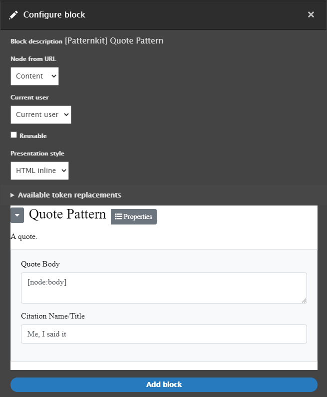

# Creating your first Patternkit Pattern


Patternkit is a module that lets you drag and drop your Drupal theme templates, patterns, and components into layouts, whether using Layout Builder, Panels, or the default Block Layout editor. See more at [https://drupal.org/project/patternkit](https://drupal.org/project/patternkit).

Assuming you already know how to create a Drupal theme, or have an existing theme you're modifying, it's just a few steps to add a pattern to the Patternkit list and use the editor.

1. **Add your new pattern / choose an existing pattern**
1. **Add a JSON schema file in the same directory**
1. **Clear caches**
1. **Add via Layout Builder!**

If you're looking for a place to start building with Drupal locally, check out [https://docksal.io/](https://docksal.io/).

Also make sure the modules we're using today are enabled.

```
drush en -y layout_builder patternkit
```

## Add your new pattern / choose an existing pattern
Many themes include lots of fun and interesting patterns to use for building pages - especially those that are based around Pattern LAB or support JSON Schema out of the box.

Here are some examples:
 - [Dev only] [Red Hat Patternfly](https://github.com/drupal-pattern-lab/patternfly_theme)
 - [Needs JSON Schema] [Forum One Gesso](https://www.drupal.org/project/gesso)
 - [Needs JSON Schema] [Phase2 Particle 11](https://github.com/phase2/particle/tree/eleven)
 - [Needs JSON Schema] [Shila Starter](https://github.com/aleksip/shila-drupal-theme)
 - [Needs JSON Schema] [Acquia Cog Theme](https://github.com/acquia-pso/cog)

Let's take the time to make one of our own though. If you don't already have a theme, create a new one. You can learn how at [Drupal.org Docs](https://www.drupal.org/docs/theming-drupal) - the most important thing is that we have a `.info.yml` file.

> For the lazy, `drush generate theme --directory=themes/custom --answers='{"name": "My Theme", "machine_name": "my_theme"}'`

First, make the template in the theme. We're using the example name 'my_theme', but you can choose whatever you like. You can pick any directory, we'll just need it for later to add it to the list of patterns. We'll use a custom theme and stick the pattern in a 'lib/patterns' folder for now. You could also use the 'templates' directory or anywhere else you like.

**docroot/themes/custom/my_theme/lib/patterns/quote/quote.twig**

<!--  -->
```twig
<blockquote class="quote-card">
  <p>
    {{quote|raw}}
  </p>      
  <cite>
    {{citation}}
  </cite>
</blockquote>
{# You only need to attach a library if you're not loading it on every page in your theme's my_theme.info.yml #}
{# @see https://www.drupal.org/docs/theming-drupal/adding-stylesheets-css-and-javascript-js-to-a-drupal-theme #}
{{ attach_library('my_theme/quote') }}
```
<!--  -->

Next, let's make sure our new quote is styled properly. You could also add your css to a main CSS file loaded at all times by the theme - up to you! For demonstration purposes, we'll keep our CSS with the pattern.

**docroot/themes/custom/my_theme/lib/patterns/quote/quote.css**

<!--  -->
```css
.quote-card {
  background: #fff;
  box-sizing: border-box;
  box-shadow: 0 2px 4px rgba(34, 34, 34, 0.12);
  color: #222222;
  min-height: 120px;
  overflow: hidden;
  padding: 20px;
  padding-left: 50px;
  position: relative;
}
.quote-card p {
  font-size: 22px;
  line-height: 1.5;
  margin: 0;
  max-width: 80%;
}
.quote-card cite {
  display: block;
  font-size: 16px;
  font-weight: 200;
  margin-top: 10px;
  opacity: 0.8;
}
.quote-card:before {
  color: rgba(238, 238, 238, 0.8);
  content: "“";
  font-family: Georgia, serif;
  font-size: 5em;
  font-weight: normal;
  left: 10px;
  position: absolute;
  top: 10px;
}
.quote-card:after {
  bottom: -110px;
  color: rgba(238, 238, 238, 0.8);
  content: "”";
  font-family: Georgia, serif;
  font-size: 25em;
  font-weight: normal;
  line-height: 100px;
  position: absolute;
  right: -32px;
}
@media (max-width: 640px) {
  .quote-card:after {
    font-size: 22em;
    right: -25px;
  }
}
```
<!--  -->

Let's make sure the theme loads our CSS and our new pattern. If you don't have a base styles CSS file, just make an empty one for now at `docroot/themes/custom/my_theme/css/styles.css`. Alternatively, if you don't have any base styles, you could skip the css and put an empty `drupalSettings: {}` line in `my_theme_library`.

**docroot/themes/custom/my_theme/my_theme.libraries.yml**

<!--  -->
```yaml
quote:
  css:
    theme:
      lib/patterns/quote/quote.css: {}

my_theme_library:
  css:
    base:
      css/styles.css: {}
  patterns:
    lib: {plugin: twig}
```
<!--  -->

## Add a JSON schema

It's great making good-looking templates, but what really makes Patternkit shine is being able to edit the data in Drupal. For that, we need a JSON schema. We need to conform to the JSON Schema format defined at [JSON-Schema.org](https://json-schema.org/understanding-json-schema/basics.html).

**docroot/themes/custom/my_theme/lib/patterns/quote/quote.json**

<!--  -->
```json
{
  "$schema": "http://json-schema.org/draft-04/schema#",
  "title": "Quote Pattern",
  "description": "A quote.",
  "category": "patterns",
  "type": "object",
  "properties": {
    "quote": {
      "title": "Quote Body",
      "type": "string",
      "format": "textarea"
    },
    "citation": {
      "title": "Citation Name/Title",
      "type": "string"
    }
  }
}
```
<!--  -->

## Clear caches

And enable your new theme if it isn't already. See [https://www.drupal.org/docs/user_guide/en/prevent-cache-clear.html](https://www.drupal.org/docs/user_guide/en/prevent-cache-clear.html).

```
drush theme_enable my_theme
drush config-set system.theme default my_theme
drush cr
```

## Add via Layout Builder
Or whatever block placement tool you like.

See [https://www.drupal.org/docs/8/core/modules/layout-builder/building-layouts-using-the-layout-builder-ui](https://www.drupal.org/docs/8/core/modules/layout-builder/building-layouts-using-the-layout-builder-ui) if you've never used Layout Builder before.

Usually the steps are like so:
1. Enable layout builder
1. Enable layout builder for your content type.
1. Edit/create some content of that type and edit the layout.


You should see a new '[Patternkit] Quote Pattern' block. Add it to the layout! You can fill in the fields yourself, or you can use Drupal tokens such as `[node:body]` to populate your quote pattern.



## ..surprise step - party!


Welcome to the new world of Patternkit!

Run into any problems?
[Search for or submit an issue](https://github.com/drupal-pattern-lab/patternkit/blob/8.x-1.x/CONTRIBUTING.md#reporting-bugs)!

Have a suggestion or question?
We're always available via the [Drupal slack](https://github.com/drupal-pattern-lab/patternkit/blob/8.x-1.x/CONTRIBUTING.md#get-an-answer-to-a-question).

We hope you enjoyed your experience and that we saved your team a bundle of work. See you online!
